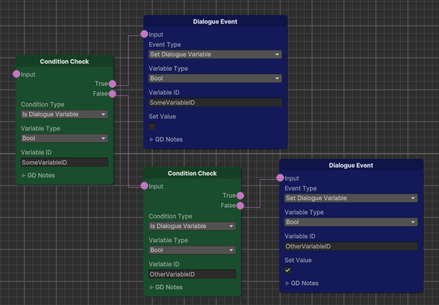
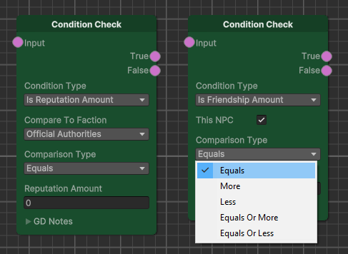
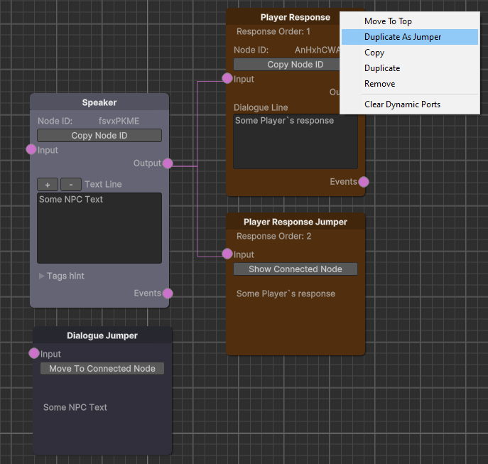

# Dialogue system with node-based editor (Documentation & Guide)

The current dialogue system provides a tool for a game designer or dialogue designer based on a node (visual programming) system.

The system also includes a suite of smaller tools, such as a unique ID generator and save editors, useful for development and testing. A complete list of the tools mentioned can be found in the relevant section of this documentation.

### List of technologies used

- MVP pattern
- VContainer (fast Dependency Injection for Unity)
- UniRx (Reactive Extensions for Unity)
- Unity XNode (general purpose node editor)
- Unity Input System
- NuGet + Microsoft.Extensions (to convert a JSON file into an Excel document)

### The beginnings of related systems

The system also includes the beginnings of other (related) systems, to the extent necessary for testing the main system:

- Data saving and loading system
- Primitive character (NPC) system (for dialog options configuration only)
- Primitive interaction system (only for starting a dialogue)
- Primitive inventory system (for placing and removing items into the inventory via dialogue, as well as for checking the presence (and quantity) of the corresponding item in the inventory)
- Primitive 1st person player controller (provides movement and NPC interaction to initiate dialogue)
- Primitive camera manager (for focusing on the NPC's "face" during dialogue)

- Primitive quest system (for changing and storing quest status)
- Primitive cursor manager (activates the cursor during a dialog to provide a choice of response options)
- Primitive UI for displaying test information and test dialog

### Creating a new dialog

Create a new dialog (Create => Dialogue Editor => New Dialogue)

A new graph (scriptable object) will be created.

Add it to the dialog database (scriptable object)

### Starting node

A newly created dialog immediately has a start node. 

The dialogue ID is generated automatically when it is created, and it can be copied to the clipboard by clicking the corresponding button. 

The "Save to JSON" button creates or updates a JSON document in the Assets/Resources/JSON/Dialogue.json directory. 

This document has the signature shown on the screen. The node type, its ID and text element are saved. This document is intended for subsequent localization of the dialog.

The start node also contains a "Save to XML" button. Clicking this button will first create (or update) a JSON file, and then create an XML document from it. This function is also intended for subsequent localization of the dialog.

### Speaker Node (text spoken by NPCs)

The speaker node (containing the text spoken by the NPC) can be attached to the start node or to the player's response node,  either directly or through the intermediary of a condition check node.

The speaker node has its own ID, which is generated automatically when it is created (as well as copied or duplicated), and can be copied to the clipboard by pressing the corresponding button. 

This node also has a text input field and buttons to control the height of this field.

This button also has a collapsible tooltip with a tag to insert the player's name into the text.

When using this tag, when showing a dialog in the interface, this tag will be replaced with the player's name, which will be obtained from his config.

This node also has two outputs. The upper one is for attaching player response nodes. The lower one is for attaching event nodes.

### Player Response Node

The output for attaching a player response node allows multiple nodes to be attached. The player response node can be attached to this output either directly or through the intermediary of a condition check node.

The player's response node has a unique ID that is generated automatically and can be copied to the clipboard.

It also contains a text input field and two outputs - for attaching the next node with NPC text and for attaching event nodes.

The speaker node (containing the words spoken by the NPC) can be attached to the player response node either directly or via a condition check node.

### Event Nodes

An event node can be connected to the bottom output of a speaker node or a player response node. It can be connected either directly or via a condition check node. Multiple event nodes can be connected to each output for connecting an event node.

The event node options depend on the type of event that is selected.

The event node also has a collapsible field for notes.

Events of the "add friendship" and "has met" types can be called for the current NPC (the one currently communicating with the player) or for another NPC. In the second case, you will need to specify the ID for the NPC.

Events like "start trading" and "start fighting" do not have any additional options. In the current project, trading and fighting are not implemented properly, so using these two events in a dialog will simply output the corresponding messages to the console. In the current project, it is enough to organize a subscription to these events for the appropriate reaction of the NPC.

When selecting the "set quest state" event type, you will also be prompted to select a new state from the drop-down list.

When selecting the "set variable value" event type, you will also be prompted to select the value type (logical or numeric) and then set it. This event type is specifically designed to allow configuration of dialog variables for which no separate logic has been created, as well as to call unique custom events.

The events "give the player an item or take it" and "give the player money or take it" are almost identical, except that you need to specify an ID for the item.

The event of the "accrue reputation" type assumes the choice of one of the existing factions. The reputation value can be negative if we want to reduce it.

The "play sound" and "play animation" events are for when we want to have voiced dialogue or if we want the NPC to participate more vividly in the dialogue by playing the appropriate animations. These two functions are not implemented in this project, but could easily be added in a real project.

### Condition Check Node

A condition check node can precede a speaker node (containing the text spoken by the NPC), a player response node, or an event node.

Multiple condition check nodes can be connected in series.

The condition check node contains a drop-down list for selecting the condition type, as well as a hidden field for notes.

Most of the checks are for the same variables that we change with the corresponding events. We can also check the player's gender and race.

For all quantity checks (friendship, reputation, etc.) we can specify a comparison operator.

Checks to see if the player has enough money are used to check if something can be purchased or before offering a bribe. Checking to see if the player has enough items is useful to determine the status of some quests.

If a player tries to intimidate or persuade an NPC, a special type of check is provided to determine the result of this action. It is assumed that this result will depend on many conditions, such as the value of the corresponding player characteristic or the effect of certain effects on him (for example, buffs).

### Jumpers

For the purpose of moving the dialogue to a specific node, the editor provides the presence of corresponding jumpers.

To create a jumper, right-click on the speaker node or the player's response node and select "duplicate as jumper" from the drop-down list. After that, the corresponding jumper will be created, and it can be dragged to any desired place in the dialog and attached to the output as a regular text node.

For ease of use, the jumper displays the text contained in the corresponding field of the node it leads to. When this text is changed in the target node, the text in the jumper will also be changed.

Using the "show connected node" button will quickly move to the target node, which is convenient for testing the dialog.

If the node associated with the jumper is deleted, the corresponding warning will be shown on the jumper. The jumper itself will not be deleted, so as not to forget where it was provided.

### Auxiliary tools

All auxiliary tools are combined into one separate prefab, which can be found at: Assets/Prefabs/TOOLS.prefab

To use this tool, simply drag and drop the prefab into the scene hierarchy.

The ID generator allows you to generate an eight-digit alphanumeric identifier, as well as quickly copy it to the clipboard. This is useful for generating identifiers for items, quests, NPCs, etc.

The player data configuration tool allows you to configure the player's gender, name, race, and manage his reputation level with the three test factions presented in the project. 

Negative values are allowed when specifying the reputation level.

The character data (NPC) configuration tool allows you to set the friendship level with the player (a negative value is allowed), as well as "remember" whether this NPC has met the player before.

The Quest Data Configuration tool allows you to set or reset the current state of the quest.

The inventory data configuration tool allows you to "place" items into your inventory, remove them, or change their quantity.

The tool for configuring these dialog variables allows you to manage their values (boolean and quantity types are provided)

